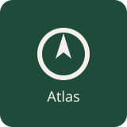

  

# OSINT Atlas

🇪🇸 [Español](23#español)  🇬🇧/🇺🇸 [English](23#english)

## 🇪🇸 Español

OSINT Atlas es un catálogo de consulta de fuentes abiertas y guias de procedimientos.

[OSINT](https://es.wikipedia.org/wiki/Inteligencia_de_fuentes_abiertas) quiere decir Open Source Intelligence, inteligencia de fuentes abiertas.

Este catálogo ayuda a elegir una fuente, leer su resultado y ver qué falta comprobar.

> La guía publicada está en [comunidad-de-inteligencia.github.io/osint-atlas](https://comunidad-de-inteligencia.github.io/osint-atlas/).

> [!WARNING] 
> Ante un peligro inmediato, acude al servicio oficial de emergencias de tu territorio.  
> Consulta el [procedimiento de emergencia](docs/es/procedimientos/emergencia-inmediata.md) y las [vías oficiales](docs/es/contactos.md).

> [!IMPORTANT]
> OSINT Atlas no recibe denuncias y no envía alertas.

> [!NOTE]
> OSINT Atlas no es una aplicación, ni un visor, ni un mapa en directo.

> [!IMPORTANT]
> Patrocinar contribuye a apoyar el proyecto, pero no da derecho al patrocinador a adquirir un archivo ni a recibir una revisión.

Quien consulta con un asistente de Inteligencia Artificial usa el Model Context Protocol (MCP) en modo de solo lectura.  
Sigue siendo una forma de leer el catálogo, no de actuar en su nombre. 

Los detalles están en [usar el catálogo con un asistente](docs/es/ia.md).

## 📇 Índice

- [Primeros pasos](23#primeros-pasos)
- [En qué territorio](23#en-qué-territorio)
- [Qué información tengo](23#qué-información-tengo)
- [Guías de referencia](23#guías-de-referencia)
- [Qué está revisado](23#qué-está-revisado)
- [Cómo proponer una fuente](23#cómo-proponer-una-fuente)
- [Reporte de seguridad](23#reporte-de-seguridad)
- [Licencia](23#licencia)

## 🔰 Primeros pasos

- **Empezar:** [un recorrido en cinco minutos](docs/es/empezar.md).
- **Investigar y contrastar:** [empresas](docs/es/procedimientos/investigar-empresa.md), [contratos y ayudas](docs/es/procedimientos/contratos-subvenciones.md), [publicaciones oficiales](docs/es/procedimientos/publicaciones-oficiales.md), [dominios](docs/es/procedimientos/huella-dominio.md), [imágenes](docs/es/procedimientos/verificar-imagen.md), [conclusiones](docs/es/procedimientos/contrastar-conclusiones.md), [afirmaciones jurídicas](docs/es/procedimientos/afirmacion-juridica.md) o [estadísticas](docs/es/procedimientos/afirmacion-estadistica.md).
- **Desapariciones:** [adultos](docs/es/procedimientos/desaparicion-adulto.md) o [menores](docs/es/procedimientos/desaparicion-menor.md).
- **Emergencias:** [actuación inmediata](docs/es/procedimientos/emergencia-inmediata.md) o [desastres y crisis](docs/es/procedimientos/desastre-crisis.md).
- **Protección y reporte:** [grooming y sextorsión](docs/es/procedimientos/grooming-sextorsion.md), [violencia sexual digital](docs/es/procedimientos/violencia-sexual-digital.md), [posible abuso sexual infantil](docs/es/procedimientos/reportar-csam.md) o [Telegram y otras plataformas](docs/es/procedimientos/reportar-plataformas.md).

## 🌐 En qué territorio

Árbol de territorios:

- 🌐 [Global](docs/es/indices/jurisdiccion-global.md)
  - 🌍 [Europa](docs/es/indices/jurisdiccion-europe.md)
    - 🇪🇺 [Unión Europea](docs/es/indices/jurisdiccion-eu.md)
      - 🇪🇸 [España](docs/es/indices/jurisdiccion-es.md)
        - 🇪🇸 [País Vasco](docs/es/indices/jurisdiccion-es-pv.md)
          - 🇪🇸 [Bilbao](docs/es/indices/jurisdiccion-es-bi.md)
        - 🇪🇸 [Comunidad Foral de Navarra](docs/es/indices/jurisdiccion-es-nc.md)
        - 🇪🇸 [Madrid](docs/es/indices/jurisdiccion-es-mad.md)
      - 🇵🇹 [Portugal](docs/es/indices/jurisdiccion-pt.md)
      - 🇫🇷 [Francia](docs/es/indices/jurisdiccion-fr.md)
      - 🇩🇪 [Alemania](docs/es/indices/jurisdiccion-de.md)
      - 🇮🇹 [Italia](docs/es/indices/jurisdiccion-it.md)
    - 🇬🇧 [Reino Unido](docs/es/indices/jurisdiccion-gb.md)
  - 🌎 [América](docs/es/indices/jurisdiccion-america.md)
    - 🇧🇷 [Brasil](docs/es/indices/jurisdiccion-br.md)
    - 🇲🇽 [México](docs/es/indices/jurisdiccion-mx.md)
    - 🇨🇴 [Colombia](docs/es/indices/jurisdiccion-co.md)
    - 🇦🇷 [Argentina](docs/es/indices/jurisdiccion-ar.md)

> El Reino Unido no forma parte de la Unión Europea. Consultar [Estados miembros de la Unión Europea](https://european-union.europa.eu/principles-countries-history/eu-countries_es)

Una cámara de Madrid se encuentra desde España y en su propia página.

La [cobertura](docs/es/cobertura.md) usa el mismo árbol. Un recurso global puede ayudar sin cubrir el procedimiento local.

## 🔎 Qué información tengo

Partiendo de:
- una [organización](docs/es/indices/entrada-organizacion.md)
- un [expediente](docs/es/indices/entrada-expediente.md)
- un [documento](docs/es/indices/entrada-documento.md)
- un [dominio](docs/es/indices/entrada-dominio.md)
- un [lugar](docs/es/indices/entrada-lugar.md)
- un [indicador](docs/es/indices/entrada-indicador.md)
- una [situación](docs/es/indices/entrada-situacion.md)
- una [plataforma](docs/es/indices/entrada-plataforma.md)
- una [pregunta por contrastar](docs/es/indices/entrada-pregunta.md)

[Explorar el catálogo](docs/es/catalogo.md).

## 📚 Guías de referencia

- [Radiotelefonía](docs/es/referencias/radiotelefonia.md)
- [GEOINT abierto](docs/es/referencias/geoint-abierto.md). GEOINT es Geospatial Intelligence, inteligencia geoespacial.
- [Copernicus en QGIS](docs/es/referencias/qgis-copernicus.md). QGIS es el programa de escritorio, hoy llamado así; antes, Quantum GIS.

## 📶 Qué está revisado

Indicadores de estado de revisión:
- ⭕ Pendiente de revisión
- ✔️ Revisado
- ❌ Revisado como pendiente de cambio

> [!IMPORTANT]
> Los cambios sensibles (PR) hechos por un usuario tienen como requisito su revisión por parte de otra persona competente (roles).
>
> Mientras un cambio no esté registrado, las propuestas siguen pendientes.

La última comprobación de una página se puede leer en su ficha y en el [informe de mantenimiento](https://github.com/Comunidad-de-Inteligencia/osint-atlas/blob/maintenance-state/README.md)

Indicadores de estado de una fuente: 
- Disponible
- Sin respuesta (no disponible) 
- Requiere autenticación
- No comprobado
> [!NOTE]
> Si no hubo ejecución de la comprobación de la fuente, se marca como «No comprobado».
>
> Un escudo de Actions (indicador de estado) indica si el proceso automático corrió y si recibió respuesta por parte de la fuente.

## ✉️ Cómo proponer una fuente

Para proponer una nueva fuente, abre una incidencia con la plantilla en [castellano](https://github.com/Comunidad-de-Inteligencia/osint-atlas/issues/new?template=proponer-fuente.yml) o en [inglés](https://github.com/Comunidad-de-Inteligencia/osint-atlas/issues/new?template=propose-source.yml). 

Para solicitar una corrección, usa [castellano](https://github.com/Comunidad-de-Inteligencia/osint-atlas/issues/new?template=corregir-contenido.yml) o [inglés](https://github.com/Comunidad-de-Inteligencia/osint-atlas/issues/new?template=correct-content.yml). 
> No pegues casos ni datos personales. Los detalles se indican en [cómo contribuir](docs/es/contribuir.md).

## 🏗️ Con qué está hecho

| Pieza | Papel en este catálogo | Tecnología |
| --- | --- | --- |
| Catálogo | Documentos | Markdown |
| GitHub Actions | Validación inicial de cada propuesta y comprobación automática de enlaces | --- |
| Guía | Facilita la lectura y presentación | [GitHub Pages](https://pages.github.com/) y [Mkdocs + Material](https://squidfunk.github.io/mkdocs-material/) |
| Python 3.12 | Generador, pruebas y MCP | --- |
| uv | Entorno y dependencias bloqueadas | --- |
| [QGIS](https://qgis.org/) | Programa externo para ver una capa. Independiente de este repositorio | --- |

## 🔏 Reporte de seguridad
Un fallo del código o de seguridad se puede avisar como se indica en [seguridad](docs/es/seguridad.md).

## ⚖️ Licencia

Uso bajo la licencia MIT, Massachusetts Institute of Technology.  
Puedes consultar el documento de [uso responsable](docs/es/legal.md) y el archivo [LICENSE](LICENSE).  
La procedencia se indica en [atribución](docs/es/atribucion.md). 

> [Incidencias][issues]. [Licencia MIT][license]. [Guía](https://comunidad-de-inteligencia.github.io/osint-atlas/).

> [Glosario](docs/es/glosario.md). [Mantenimiento](docs/es/mantenimiento.md). [Accesibilidad](docs/es/accesibilidad.md).

[issues]: https://github.com/Comunidad-de-Inteligencia/osint-atlas/issues
[license]: https://github.com/Comunidad-de-Inteligencia/osint-atlas/blob/main/LICENSE

---

## 🇬🇧/🇺🇸 English

OSINT Atlas is a reference catalog.

[OSINT](https://en.wikipedia.org/wiki/Open-source_intelligence) means Open Source Intelligence. It helps you choose an open source, read what a result can mean, and see what is still unchecked. 

The published guide is at [comunidad-de-inteligencia.github.io/osint-atlas](https://comunidad-de-inteligencia.github.io/osint-atlas/).
> [!WARNING] 
> In immediate danger, contact the official emergency service where you are.
>
> Start with the [emergency procedure](docs/es/procedimientos/emergencia-inmediata.md) and [oficial emergency contacts](docs/es/contactos.md). 
> Those pages are currently in Spanish and need translators to provide support and suggest official sources.

> [!IMPORTANT]
> OSINT Atlas does not collect reports and does not send alerts automatically.

> [!NOTE]
> OSINT Atlas is not an application, a viewer, or a live map, and it does not receive reports.

> [!IMPORTANT]
> Sponsorship helps supporting the project, but does not entitle the sponsor to the acquisition of a catalog entry or to a review.

Catalog entries, procedures, and the territory index above stay in Spanish until someone can review other language.

- [English index](docs/en/index.md)
- [Glossary](docs/en/glossary.md)
- [How to contribute](docs/en/contributing.md)
- [Five-minute tour](docs/en/start.md)
- [Responsible use](docs/en/legal.md)
- [Attribution](docs/en/attribution.md)
- [Security](docs/en/security.md)
- [Accessibility](docs/en/accessibility.md)
- [Maintenance](docs/en/maintenance.md)
- [Using an assistant](docs/en/ai.md)

An assistant reads the catalog through the Model Context Protocol (MCP). Here that connector is read-only. 

Use is under the MIT license, the Massachusetts Institute of Technology license, in [LICENSE](LICENSE).
