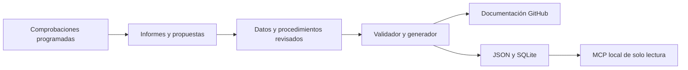

# OSINT Atlas

Catálogo privado y verificable de fuentes y procedimientos OSINT para España, la Unión Europea y una cobertura internacional progresiva. Está pensado para personas y asistentes de IA: cada recurso explica qué permite consultar, cómo interpretar el resultado y qué límites tiene.

> [!IMPORTANT]
> Si existe peligro inmediato, contacta con el servicio de emergencias de tu territorio. En la Unión Europea, llama al **112**. Este repositorio no recibe denuncias ni funciona como sistema de alertas en tiempo real.

## Elige tu recorrido

- [Empezar en cinco minutos](docs/EMPEZAR.md)
- [Explorar las 84 fuentes](docs/CATALOGO.md)
- [Elegir un procedimiento](docs/procedimientos/README.md)
- [Consultar la matriz de cobertura](docs/COBERTURA.md)
- [Usar el catálogo con IA mediante MCP](docs/IA.md)
- [Entender y activar el mantenimiento](docs/MANTENIMIENTO.md)
- [Añadir o corregir información](CONTRIBUTING.md)

## Escenarios prioritarios

### Protección de personas

- [Desaparición de un adulto](docs/procedimientos/desaparicion-adulto.md)
- [Desaparición de un menor](docs/procedimientos/desaparicion-menor.md)
- [Emergencia inmediata](docs/procedimientos/emergencia-inmediata.md)
- [Desastres y crisis](docs/procedimientos/desastre-crisis.md)
- [Grooming o sextorsión](docs/procedimientos/grooming-sextorsion.md)
- [Violencia sexual digital](docs/procedimientos/violencia-sexual-digital.md)
- [Posible material de abuso sexual infantil](docs/procedimientos/reportar-csam.md)
- [Telegram y otras plataformas](docs/procedimientos/reportar-plataformas.md)

### Investigación y verificación

- [Empresas](docs/procedimientos/investigar-empresa.md)
- [Contratos y subvenciones](docs/procedimientos/contratos-subvenciones.md)
- [Publicaciones oficiales](docs/procedimientos/publicaciones-oficiales.md)
- [Huella pública de dominios](docs/procedimientos/huella-dominio.md)
- [Verificación de imágenes](docs/procedimientos/verificar-imagen.md)
- [Contraste de conclusiones](docs/procedimientos/contrastar-conclusiones.md)
- [Afirmaciones jurídicas](docs/procedimientos/afirmacion-juridica.md)
- [Afirmaciones estadísticas](docs/procedimientos/afirmacion-estadistica.md)

## Cómo está construido

Las fichas editables están en `data/`; los documentos de `docs/fuentes/`, los índices, las exportaciones JSON y la base SQLite se generan de forma determinista. El servidor MCP solo consulta el catálogo y nunca envía reportes ni accede a las fuentes externas.

Descripción textual: los datos y procedimientos aprobados producen documentación y artefactos de búsqueda; las comprobaciones externas generan informes y propuestas que necesitan revisión antes de cambiar contenido sensible.

## Estado de la v0.1

- 84 recursos y 16 escenarios con procedimiento.
- España en profundidad, fuentes comunes de la UE y recursos globales.
- Cobertura inicial de Portugal, Francia, Alemania, Italia, Reino Unido, Brasil, México, Colombia y Argentina.
- Revisión automática diaria, semanal y mensual preparada mediante GitHub Actions.
- Reparto por especialidad preparado; faltan asignar los usuarios de GitHub de los colaboradores.

Consulta [las condiciones de uso](LEGAL.md), [la política de seguridad](SECURITY.md) y [la atribución](ATTRIBUTION.md).
